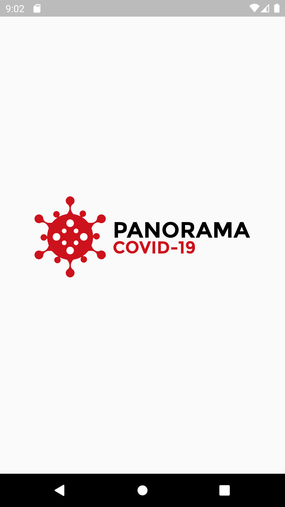
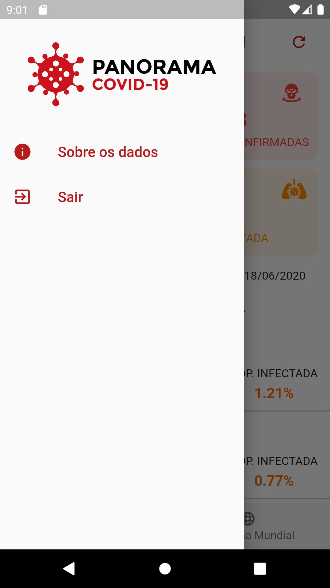
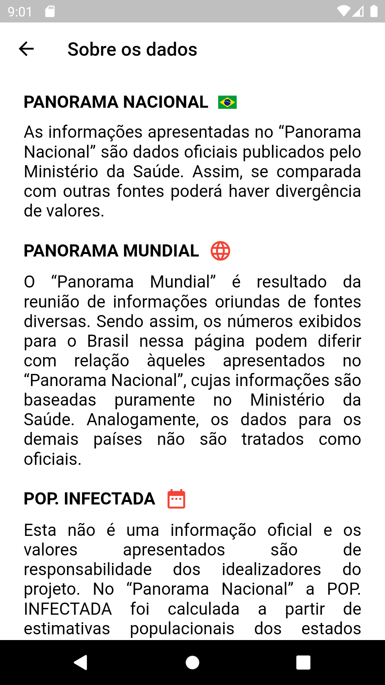
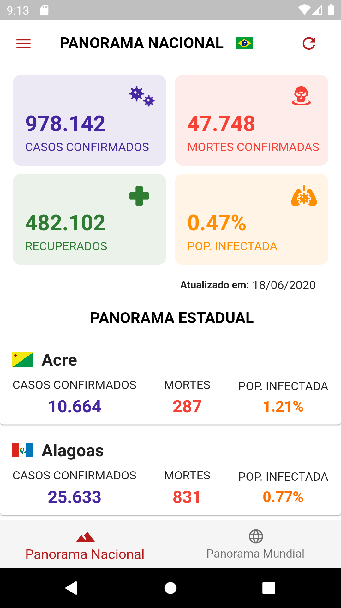
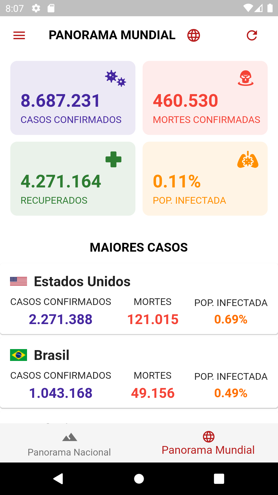

<h1 align="center">
 
</h1>
&nbsp;&nbsp;

## 📱 Application screens

 &nbsp;
 &nbsp;
 &nbsp;
 &nbsp;

&nbsp;&nbsp;&nbsp;

## 📋 About the project

The project in question is an application developed in the Dart languague and entitled **PANORAMA COVID-19** which brings a simple proposal: to gather in one place the information about COVID-19 in Brazil and in the world, in a simple and intuitive way.

## 💪🏼 Motivation

The pandemic caused by the new coronavirus is a topic on all the news in the world, but I have not found any application that would provide information clearly about the cases in Brazil and in the world. Thus, this project was conceived in order to develop an application that would deliver this information to the user.

## 🛸 Technologies
The application was developed with the following technologies:

* 🛠  [Flutter](https://flutter.dev/)
* ⚙️ [Slidy](https://github.com/Flutterando/slidy)
* 💎 [Flutter Modular](https://github.com/Flutterando/modular)
* 🛢 [Mobx](https://pub.dev/packages/mobx)
 

## 💡 Layout
The application layout was conceived creating a mental concept, mixing various UI's influences available on the website [**Dribbble**](https://dribbble.com/) and throughout the project, all credits are directed to the  [**Freepik**](https://www.freepik.com/) website, which provides free vectors to be used, as can be seen by accessing the logo link used in the project, clicking [**HERE**](https://www.freepik.com/free-vector/coronavirus-logo-concept_7607473.htm#page=1&query=covid-19%20logo&position=24).

## 📊 What information does the application provide? 
As a whole the project presents 4 information about COVID-19:

* 😷 Confirmed cases 
* 🥳 Recovered
* 💀 Confirmed deaths
* ☣️ Percentage of infected population  

This information is available in 02 (two) different panoramas: **National** and **World**.

#### 🌴 NATIONAL PANORAMA
It presents the information cited for Brazil and all its states.  

#### 🌍 WORLD PANORAMA
It presents the information mentioned for all cases in the world and also presents the **RANKING COVID - TOP 20**, which brings the 20 (twenty) countries with the highest number of cases of the new coronavirus.

## 🧱 How to contribute?
This project was my own initiative to compose my development portfolio. If you want to contribute to the project, I will be very grateful, I am starting now in development and any support that helps me to evolve will be very well regarded, even criticism. If you want to contribute, send your Pull Requests and I will be happy to evaluate them, just follow the following steps:

1. Fork this repository.
2. Access the [config.dart](lib/app/shared/config.dart) file and make sure that the **LOCAL_STORAGE** variable is set to **true**, because the project has a data file for local tests.  
3. Create a **branch** for your update (git checkout -b feature/feature_name).
4. Commit (git commit -m "your commit").
5. Push (git push origin feature/feature_name).
6. Create a new **Pull Request**.

Contact me:

* 📧 E-mail: aeduaardo.dev@gmail.com
* 🌐 Linkedin: www.linkedin.com/in/aeduaardo  

## ⚖️ License
This project is licensed under the MIT license - see the file [LICENSE](LICENSE) and learn more details. 

# 📲 How do I get the app?
Currently this application is online, but it is not found in the Play Store, because it does not allow the provision of applications related to COVID-19 that are not from government agencies or authorized institutions. To install it on your device follow these steps:

1. Access your device's **Settings**.
2. Go to **Security** and select **unknown sources**. Selecting this option will allow you to install apps that are outside the Play Store.  
**Note**: Depending on your device, you may choose to be warned before installing applications that are considered harmful.
3. Now, just [**DOWNLOAD**](https://bit.ly/PANCOVID-19) the .apk and perform the installation.
